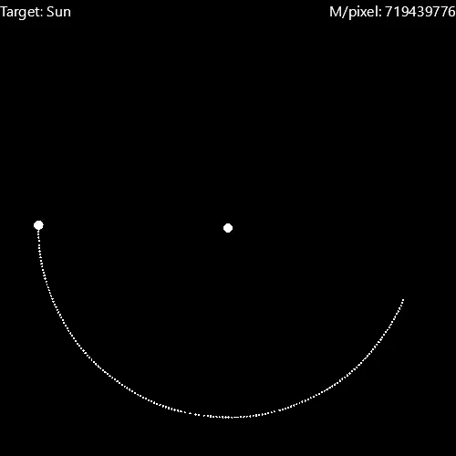

# universe.py

## **universe.py** is a python-numba 2-dimensional n-body simulation with an accompanying pyglet gui display.

This project is not meant to be a completely accurate simulation, though it does aim to rely on actual scientific calculations to maintain a degree of realism. Testing and development is done on python 3.11.0 with the pre-release for [Numba 0.57 RC](https://github.com/numba/numba/issues/8841).

universe.py is mostly just a for-fun project and is the third iteration of an n-body simulation I have made throughout the past few years as I have become more acquainted with python.

Heavy computation is allotted to [numba](https://github.com/numba/numba) via a [custom modified implementation of a jitclass](./universe/partial_jitclass) which allows specifications of strongly typed function type signature as well as allowing both njit compiled and interpreted functions and variables. Applications of this "partial jitclass" and numba in general can generally be found under [universe/obj](./universe/obj/).

GUI and graphics are powered by [PySide6](https://wiki.qt.io/Qt_for_Python) and [Pyglet](https://github.com/pyglet/pyglet) respectively, using pyglet for the 2-dimensional graphics and pyside for the secondary settings window. Applications of these libraries can generally be found under [universe/gfx](./universe/gfx/).

[main.py](./main.py) provides an example system with the same parameters of the Sun, Moon, and Earth. The simulation can be started by pressing ENTER. The object that the camera follows can be cycled by pressing TAB. The zoom of the camera can be adjusted either by scrolling, sliding the zoom slider, or manually editing the zoom scale. The speed of the simulation can be adjusted by either sliding the speed slider or manually selecting a timestep. Screenshots can be saved by pressing S, and are saved to ./screenshot.png. Videos can be taken by pressing V to start recording, and then V to save the video to ./video.mp4. Video recording is not stored very efficiently in memory, so long recordings may run into ram issues.